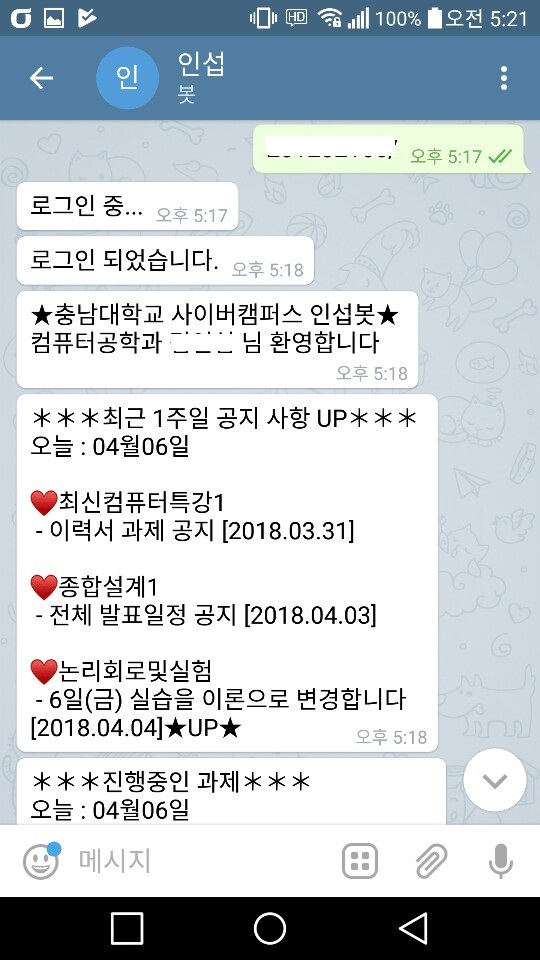
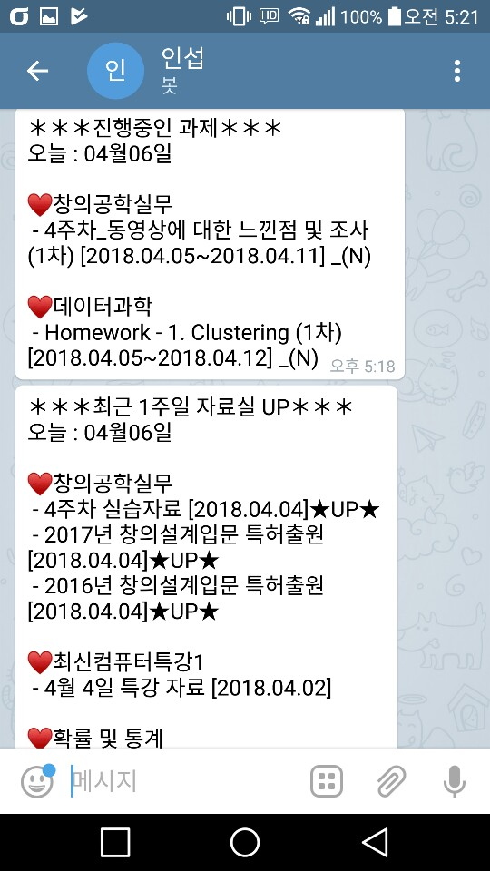
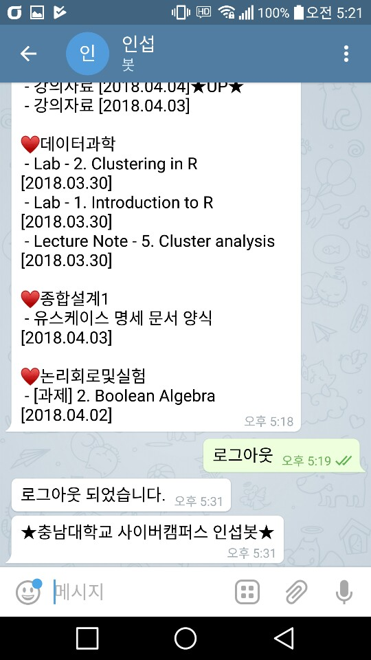

# 텔레그램봇 API를 활용한 웹 크롤링 알람 봇. (테스트용..)
* 충남대학교 사이버캠퍼스 사이트의 공지사항,자료실,과제 게시판에 업로드 된 사항들을 일정 간격으로 크롤링하여 새로운 글이 올라오면 알람을 보내주는 봇입니다.

## 텔레그램 봇 바로가기 (현재는 서버 중지)
[텔레그램 인섭봇](https://t.me/inseop_bot)

## 개발환경
* python3.7
* beautifulsoup4 4.6.3

## Server
* raspberrypi3

## 실행 결과

